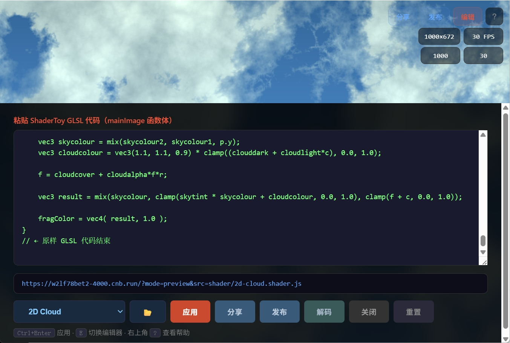

# Shader Runner

一个纯前端的 GLSL 着色器本地运行器，支持编辑、预览、分享和服务器发布。

## 功能

- **编辑模式** — 粘贴 ShaderToy 的 `mainImage` GLSL 代码，实时编译运行
- **预览模式** — 全屏渲染，无 UI 干扰，通过 URL 参数控制
- **内置 shader 选择器** — 下拉列表切换内置 shader，切换即时生效
- **本地文件打开** — 从本地选择 `.glsl` / `.frag` 文件直接加载
- **本地压缩分享** — lz-string 压缩 shader 代码到 URL hash 中，无需服务器存储
- **文件短链接分享** — 内置 shader 自动生成 `?src=` 短链接，无需压缩编码
- **服务端发布** — 使用 Netlify Blob Storage 存储，URL 只含 8 位短 ID
- **帧率限制** — 设置 FPS 上限，降低 GPU 占用
- **分辨率限制** — 限制渲染分辨率最大边长，降低 GPU 开销，画面自动缩放填满
- **自动暂停** — 页面不可见时自动暂停，恢复后继续；预览模式支持加载后按毫秒自动暂停
- **合成尺寸** — 实时显示渲染分辨率与帧率，帮助评估性能




## 快速开始

直接将 `index.html` 拖到浏览器中打开即可使用，无需任何构建步骤。

```
# 本地打开
open index.html

# 或通过 HTTP 服务
npx serve .
```

## URL 参数

| 参数 | 说明 | 示例 |
|---|---|---|
| `mode` | 页面模式：`edit`（默认）或 `preview` | `?mode=preview` |
| `code` | lz-string 压缩的 shader 代码（放在 hash 中） | `#code=L8RjIMoz...` |
| `id` | 服务端存储的 shader ID | `#id=Ab3xK9mQ` |
| `src` | 加载内置 shader 文件路径 | `?src=shader/synthwave.shader.js` |
| `maxSize` | 限制渲染分辨率最大边长（像素），0=不限，默认使用 DPR 全分辨率 | `?maxSize=720` |
| `fpsCap` | 帧率上限（帧/秒），0=不限 | `?fpsCap=30` |
| `autoPauseMs` | （仅预览模式）加载后经过指定毫秒自动暂停，手动操作后失效 | `?autoPauseMs=3000` |

### 生成分享链接

```
https://your-site.com/?mode=preview#code=L8RjIMoz...      # 本地压缩
https://your-site.com/?mode=preview#id=Ab3xK9mQ            # 服务端发布
https://your-site.com/?mode=preview&src=shader/synthwave.shader.js  # 文件短链接
```

## 部署

### 方式一：Netlify

[](https://app.netlify.com/start)

```
git push  # 或手动上传项目到 Netlify
```

项目包含 `netlify/functions/shader.js`，Netlify 会自动部署 Serverless Function 和 Blob Storage，支持「发布」功能。

本地测试：

```bash
npm install
ntl dev
```

### 方式二：Vercel

[](https://vercel.com/new)

支持「发布」功能。存储默认使用内存（重启后丢失），如需持久化可换用 [Vercel KV](https://vercel.com/docs/storage/vercel-kv) 或 [Vercel Blob](https://vercel.com/docs/storage/vercel-blob)。

### 方式三：任意静态托管（GitHub Pages / cnb.run / Cloudflare Pages 等）

直接上传 `index.html` 和 `shader/` 目录即可。注意：此方式不支持「发布」功能（需要 Serverless 函数）。

## 项目结构

```
/
├── index.html                       # 主页面（含所有逻辑）
├── shader/
│   └── *.shader.js          # 内置 shader
├── README.md                        # 文档
├── vercel.json                      # Vercel 部署配置
├── api/
│   └── shader.js                    # Vercel Serverless Function
├── netlify.toml                     # Netlify 部署配置
├── package.json                     # 依赖声明（Netlify）
└── netlify/
    └── functions/
        └── shader.js                # Netlify Function
```

## 工作原理

### shader 加载方式

内置 shader 存储在 `shader/*.shader.js` 文件中，每个文件是一个自执行的 IIFE：

```js
(function(w){
  var d = (w.__SHADER_REGISTRY__ = w.__SHADER_REGISTRY__ || []);
  d.push({ path: 'shader/xxx.shader.js', label: '名称', code: `GLSL 代码` });
})(window);
```

`index.html` 启动时通过 `<script>` 标签动态加载这些文件（`<script>` 不受 CORS 限制），加载完成后将注册表内容填入内置 shader 列表。若页面被 iframe 嵌入，这种方式也能正常工作。

### 分享流程

```
用户粘贴/选择 GLSL 代码
        │
        ▼
   编辑模式 → 点击「分享链接」
        │
        ├──→ 来自内置文件 → 生成 ?src=path 短链接
        │
        ├──→ 自定义代码 → lz-string 压缩 → #code=...
        │    （纯前端，数据在 URL 中，离线可用）
        │
        └──→ 点击「发布」
             └──→ POST /api/shader
                  ├── Netlify: redirect → /.netlify/functions/shader → Blob Storage
                  └── Vercel:  → api/shader.js → 内存存储
                       └──→ 返回 8 位短 ID → #id=...
```

### 解码流程

```
用户粘贴 URL 或编码数据到 URL 文本框
        │
        ▼
   点击「解码」按钮
        │
        ├──→ 从 URL 提取 hash 中的 code/id 参数
        ├──→ decodeURIComponent → lz-string 解压
        └──→ 还原到编辑框并自动编译运行
```

## 预设的 ShaderToy Uniforms

你的 shader 代码可以直接使用以下变量：

| 变量 | 类型 | 说明 |
|---|---|---|
| `iResolution` | `vec3` | 画布分辨率 (xy) |
| `iTime` | `float` | 运行时间（秒） |
| `iTimeDelta` | `float` | 帧间隔时间 |
| `iFrame` | `float` | 当前帧编号 |
| `iMouse` | `vec4` | 鼠标位置 (xy=当前位置, zw=按下位置) |
| `iDate` | `vec4` | 年/月/日/秒比例 |
| `iSampleRate` | `float` | 采样率 = 44100 |
| `iChannel0~3` | `sampler2D` | 纹理通道（默认白色纹理） |

函数签名须符合 ShaderToy 标准：

```glsl
void mainImage(out vec4 fragColor, in vec2 fragCoord) {
    // 你的着色器代码
    fragColor = vec4(1.0);
}
```

## 技术栈

- **WebGL2** — 硬件加速渲染
- **lz-string** — 浏览器端 LZ 压缩，3~5x 压缩率
- **Netlify Blob Storage** — 服务端键值存储（可选）
- **Vercel Serverless Functions** / **Netlify Functions** — 服务端发布
- 纯 HTML/CSS/JS，无外部依赖
