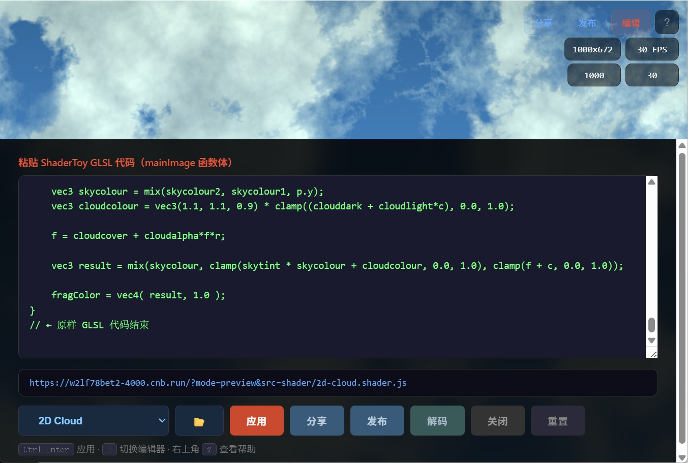

# Shader Runner

一个纯前端的 GLSL 着色器运行器，支持编辑、预览、分享与服务端发布。

## 为什么选择本项目
- 可静态托管。不依赖nodejs/python/java/php等环境。
- 单文件特效。1个特效有且只有1个文件。便于AI辅助开发和复制分享。
- 可移植性强。大量（并非全部）shaderstoy的shader可以快速复制到本环境中使用；本环境适用的shader 100%能够复制到shaderstoy中使用。

## 功能

- **编辑模式** — 粘贴 ShaderToy 的 `mainImage` GLSL 代码，实时编译运行
- **预览模式** — 全屏渲染，无 UI 干扰，通过 URL 参数控制
- **内置 shader 选择器** — 下拉列表切换内置 shader，切换即时生效
- **本地文件打开** — 从本地选择 `.glsl` / `.frag` 文件直接加载
- **本地压缩分享** — lz-string 压缩 shader 代码到 URL hash 中，无需服务器存储
- **文件短链接分享** — 内置 shader 自动生成 `?src=` 短链接，无需压缩编码
- **服务端发布** — 使用 Netlify Blob Storage 存储，URL 只含 8 位短 ID
- **帧率限制** — 设置 FPS 上限，降低 GPU 占用
- **分辨率限制** — 限制渲染分辨率最大边长，降低 GPU 开销，画面自动缩放填满
- **自动暂停** — 页面不可见时自动暂停，恢复后继续；预览模式支持加载后按毫秒自动暂停
- **合成尺寸** — 实时显示渲染分辨率与帧率，帮助评估性能


## 快速开始

使用服务器部署，或者浏览器打开本地网页均可（由于 `file://` 属于非安全上下文，部分功能受限）


```bash
open index.html    # 直接打开
npx serve .        # 或走 HTTP
```

## URL 参数

| 参数 | 说明 | 示例 |
|---|---|---|
| `mode` | 页面模式: `edit`（默认）或 `preview` | `?mode=preview` |
| `code` | lz-string 压缩的 shader（放在 hash 中） | `#code=L8RjIMoz...` |
| `id` | 服务端存储的 shader ID | `#id=Ab3xK9mQ` |
| `src` | 加载内置 shader 文件路径 | `?src=shader/synthwave.shader.js` |
| `maxSize` | 渲染分辨率最大边长（px），0=不限 | `?maxSize=720` |
| `fpsCap` | 帧率上限，0=不限 | `?fpsCap=30` |
| `autoPauseMs` | 仅预览模式：加载后按毫秒自动暂停 | `?autoPauseMs=3000` |

```
#code=...   本地压缩，纯前端
#id=...     服务端发布
?src=...    文件短链接
```

## 用 AI 开发 shader

1. 选模型。国产模型目前不擅长 GLSL：gemini > chatgpt >> glm ≈ DeepSeek
2. 新建 `.glsl`，提示词：「参考附图，写一个能直接在 shadertoy 上运行的 shader，远景是……」
3. 调试。把 GLSL 粘进页面文本框运行；报错就复制控制台信息给 AI，外观不对就描述或截图
4. 发布。`npm run add xxx` 生成产物并刷新清单

```bash
cp drafts/_temple.glsl drafts/xxx.glsl   # 建草稿
npm run add xxx                          # 加入内置：生成产物 + 刷新清单
git add shader/ && git commit            # 只提交产物，drafts/ 留在本机
```

## 草稿与内置列表

```
drafts/xxx.glsl ──add──▶ shader/xxx.shader.js ──▶ shader/manifest.js
（开发中，不提交）    （产物，提交）          （清单，自动刷新，提交）
        ▲                     │  ▲
        │                     │  └── remove（只删产物，不动草稿）
        └──────extract────────┘
```

`drafts/` 是开发中的 GLSL，**默认不提交**，只有显式 `add` 才会成为内置 shader。

| 命令 | 作用 |
|---|---|
| `npm run add <名称>` | 加入内置列表，自动刷新清单（可传多个；不带参数 = 显示状态，只读） |
| `npm run remove <名称>` | 移出内置列表：删除产物 + 刷新清单（**绝不删草稿**） |
| `npm run status` | 查看状态 |
| `npm run add:all` | 重组装已加入过的草稿（不会新增） |
| `npm run check` | 总校验（CI 用）：清单同步 + 字段检查 + 草稿同步 |
| `npm run add:check` | 只查草稿与产物是否同步（`check` 的一步） |
| `npm run drafts:extract -- shader/x.js` | 从产物反向导出可编辑草稿 |

`check` 是 `add:check` 的超集：除了草稿同步，还校验 `manifest.js` 与目录一致、每个产物的 `path` / `label` 字段正确。旧的 `npm run shaders:check` 保留为别名。

`<名称>` 怎么写都行，下面四种等价：`underwater` / `underwater.glsl` / `drafts/underwater.glsl` / `shader/underwater.shader.js`。
只做精确匹配、不做前缀补全 —— 宁可报错列出候选，也不猜你是要 `shattered-space-v11` 还是 `-v12`。
旧的 `npm run release …` 仍然可用（`add` 的等价别名）。

`remove` 只删 `shader/*.shader.js`，`drafts/*.glsl` 一份不动：草稿是没提交的手工资产。移除后草稿回到「未发布」，`npm run add xxx` 能原样加回来。
产物不是本工具生成的 / 没有对应草稿 / 含手工改动时，`remove` 会拒绝并打印补救命令，确认要丢就加 `--force`。

`drafts:extract` 的意义：草稿不入库，干净 `git clone` 只有产物、没有 GLSL 源。想改已发布的 shader，先导出成草稿，改完再发布。

### draft frontmatter（可选）

```glsl
// @label: 显示名称      // 缺省用文件名推导：aero-waves → Aero Waves
// @name:  aero-waves    // 产物名，缺省用文件名
#define TURN 6.283185307
```

写在文件开头，是元数据，不参与代码指纹计算。只认这两个 key，其它 `// @xxx:` 注释一律视为普通 GLSL 注释。

### ⚠️ 命令里出现 flag 时必须加 `--`

npm 会吞掉 `--` 之前的 flag，**且不报错**：

| 写法 | 结果 |
|---|---|
| `npm run add a` | ✓ 纯位置参数，无需 `--` |
| `npm run add:all` | ✓ 固定动作走子命令，无需 `--` |
| `npm run add -- a --label X` | ✓ 有 flag，加了 `--` |
| `npm run add a --label X` | ✗ `X` 被当成文件名 |
| `npm run drafts:extract shader/x.js --force` | ✗ 实际没有 `--force` |

flag 写在文件名后面一样会被吞。所以常用动作都做成了不带 flag 的子命令（`add:all` / `add:check` / `add:refresh` / `status` / `check`），根本没得吞。
不带参数时 `add` 是只读的，漏写 `--` 只会白跑一次，不会误改文件。

多个名称一起处理时，只要有一个被拦截就整体退出码 1（不会误判为全部成功），已成功的部分仍会写盘并同步刷新清单。

### 草稿与产物的六种状态

用三个哈希（草稿当前值 / 产物记录指纹 / 产物内代码实际值）判断哪边动过：

| 状态 | 含义 | `add` 行为 | `remove` 行为 | `--check` |
|---|---|---|---|---|
| `未发布` | 产物不存在 | 新建 | 无变化（提示） | 通过 |
| `未追踪` | 产物非本工具生成（历史 shader） | 拒绝，需 `--force` 接管 | 拒绝，需 `--force` | 通过 |
| `已同步` | 两边都没动 | 无操作 | 删除产物 | 通过 |
| `草稿有更新` | 只有草稿改了 | 用草稿更新产物 | 删除产物（草稿保留最新） | **失败** |
| `产物手工改` | 只有产物被手工编辑 | **拒绝**（会破坏手工改动） | 拒绝，需 `--force` | 仅警告 |
| `冲突` | 两边都改过 | **拒绝**，需人工合并 | 拒绝，需 `--force` | **失败** |

因此：人工调优产物不会让 CI 报警，AI 跑 `add` 也绝不会静默覆盖手工改动。把手工改动同步回草稿：

```bash
npm run drafts:extract -- shader/xxx.shader.js --force   # 导回草稿
npm run add xxx                                          # 刷新指纹
```

`--force` 只在明确要「丢弃另一边」时使用。

### 注意事项

- **不要把 `drafts/` 写进 `.gitignore`**：云环境只缓存未被 git 排除的文件，忽略会导致草稿丢失。靠提交纪律不提交即可。
- 产物由工具生成；**人可以直接手工编辑**（工具会识别并保护），AI 则一律走 `drafts/*.glsl` → `add`。

## 部署

**Netlify** — push 即部署，自动配置 Serverless Function 与 Blob Storage，支持「发布」。本地测试：`npm install && ntl dev`。

**Vercel** — 支持「发布」，存储默认在内存（重启丢失），可换 Vercel KV / Blob。

**任意静态托管**（GitHub Pages / cnb.run / Cloudflare Pages）— 上传 `index.html` 与 `shader/` 即可，但不支持「发布」功能。

## 项目结构

```
/
├── index.html                  # 主页面（含所有逻辑）
├── drafts/                     # 开发中的 GLSL 草稿（不提交，云环境缓存）
│   ├── _temple.glsl            # 草稿模板（_ 开头，不参与扫描）
│   └── *.glsl
├── shader/
│   ├── manifest.js             # 自动生成的清单
│   └── *.shader.js             # 内置 shader（AI 勿手工编辑，人可）
├── scripts/                    # 加入 / 移除 / 导出 / 清单工具（零依赖）
│   ├── release-shader.js（add）, remove-shader.js（remove）
│   ├── extract-shader.js, gen-shader-manifest.js
│   └── lib/shader-build.js
├── img/                        # 文档截图
├── api/shader.js               # Vercel Serverless Function
├── netlify/functions/shader.js # Netlify Function
├── netlify.toml, vercel.json, package.json
└── README.md
```

## ShaderToy Uniforms

| 变量 | 类型 | 说明 |
|---|---|---|
| `iResolution` | `vec3` | 画布分辨率 (xy) |
| `iTime` | `float` | 运行时间（秒） |
| `iTimeDelta` | `float` | 帧间隔 |
| `iFrame` | `float` | 帧编号 |
| `iMouse` | `vec4` | 鼠标 (xy=当前, zw=按下) |
| `iDate` | `vec4` | 年/月/日/秒比例 |
| `iSampleRate` | `float` | 采样率 = 44100 |
| `iChannel0~3` | `sampler2D` | 纹理通道（默认白色） |

```glsl
void mainImage(out vec4 fragColor, in vec2 fragCoord) {
    fragColor = vec4(1.0);
}
```

技术栈：WebGL2 + lz-string，纯 HTML/CSS/JS 无外部依赖；服务端发布可选 Netlify Blob / Vercel Functions。
